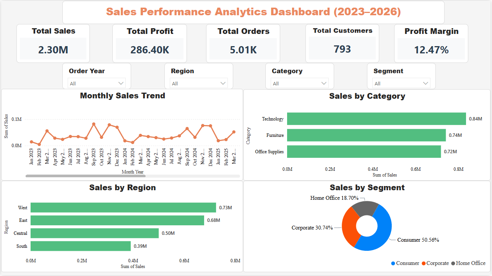
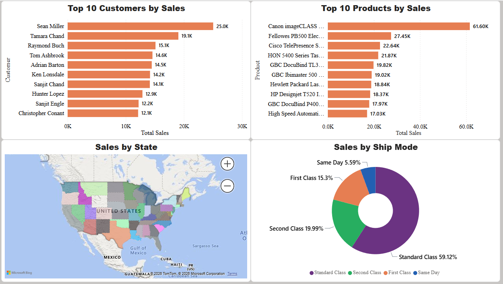

# 📊 Sales Performance Analytics Dashboard (2023–2026)



An end-to-end Business Intelligence solution that analyzes over 5,000 sales transactions to uncover trends in revenue, profitability, customer behavior, regional performance, and product sales using MySQL and Microsoft Power BI.

---

## 📌 Project Overview

Organizations generate large volumes of sales data every day, but extracting meaningful insights requires structured analysis and intuitive visualizations.

This project demonstrates a complete analytics workflow:

- Data Cleaning
- SQL Data Analysis
- KPI Calculation
- Interactive Dashboard Development
- Business Insight Generation

The dashboard provides executives with an overview of business performance while enabling analysts to drill down into customer, product, and regional performance.

---

## 🎯 Business Objectives

- Analyze overall sales performance.
- Identify high-performing products and customers.
- Compare sales across categories, regions, and customer segments.
- Monitor monthly sales trends.
- Evaluate profitability.
- Support data-driven business decisions.

---

# 🛠 Tech Stack

| Technology | Purpose |
|------------|---------|
| Microsoft Excel | Initial data cleaning |
| MySQL | Data storage and SQL analysis |
| Power BI Desktop | Dashboard development |
| DAX | KPI calculations |
| GitHub | Project documentation & portfolio |

---

# 📂 Repository Structure

```
Sales-Performance-Analytics-Dashboard
│
├── Dashboard
│   └── Sales_Performance_Analytics_Dashboard.pbix
│
├── Dataset
│   └── sales_customer_dataset.csv
│
├── SQL
│   └── sales_analysis.sql
│
├── Images
│   ├── Executive_Summary_Dashboard.PNG
│   └── Detailed_Analytical_Visuals.PNG
│
└── README.md
```

---

# 📊 Dashboard Overview

## Executive Summary Dashboard

Provides an executive-level overview using interactive KPIs and visuals.

### KPIs

- Total Sales
- Total Profit
- Total Orders
- Total Customers
- Profit Margin %

### Interactive Filters

- Order Year
- Region
- Category
- Segment

### Visualizations

- Monthly Sales Trend
- Sales by Category
- Sales by Region
- Sales by Segment

---

## Detailed Analytical Dashboard

Provides deeper business analysis.

### Visualizations

- Top 10 Customers by Sales
- Top 10 Products by Sales
- Sales by State (Map)
- Sales by Ship Mode

---

# 📈 Key Business Insights

### Sales Performance

- Generated over **2.3 Million** in sales.
- Maintained a positive profit margin of approximately **12.47%**.

### Category Analysis

- Technology generated the highest sales.
- Furniture ranked second.
- Office Supplies contributed consistent revenue.

### Regional Performance

- West region achieved the highest sales.
- South region generated the lowest revenue.

### Customer Analysis

- A small group of customers contributed significantly to total sales.
- Customer concentration highlights opportunities for loyalty programs.

### Product Analysis

- A few flagship products account for a substantial portion of revenue.
- Product mix optimization can improve profitability.

### Shipping Analysis

- Standard Class is the most frequently used shipping method.
- Same Day shipping accounts for only a small percentage of orders.

---

# 💡 Business Recommendations

- Expand marketing efforts in lower-performing regions.
- Focus promotional campaigns on high-margin product categories.
- Strengthen customer retention strategies for top customers.
- Optimize inventory for best-selling products.
- Encourage premium shipping options where feasible.
- Monitor monthly sales fluctuations for proactive planning.

---

# 📸 Dashboard Preview

## Executive Summary


---

## Detailed Analytical Dashboard



---

# 📊 Skills Demonstrated

- Data Cleaning
- Data Transformation
- SQL Querying
- KPI Development
- DAX Measures
- Business Intelligence
- Data Visualization
- Dashboard Design
- Business Analysis
- Insight Generation
- GitHub Project Documentation

---

# 🚀 Project Highlights

✔ End-to-End BI Project

✔ Interactive Power BI Dashboard

✔ SQL-Based Business Analysis

✔ Professional Documentation

✔ Portfolio-Ready Repository

---

# 👩‍💻 Author

**Naga Lakshmi Devanaboina**

M.Sc. Biotechnology 

Aspiring Data Analyst | Business Intelligence Analyst | Clinical Data Analyst

GitHub: https://github.com/nagalakshmi-dnl

LinkedIn: https://www.linkedin.com/in/devanaboina-naga-lakshmi-a290531b3/

---

## ⭐ If you found this project useful, consider giving it a Star!
